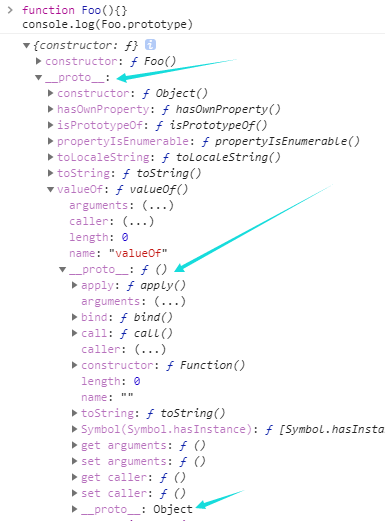
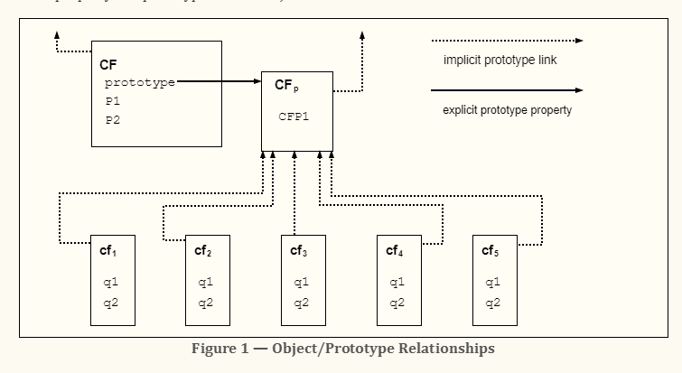
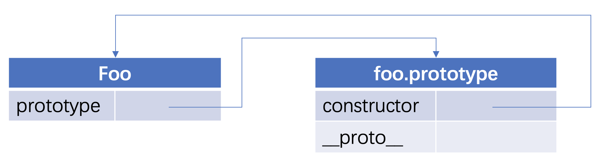
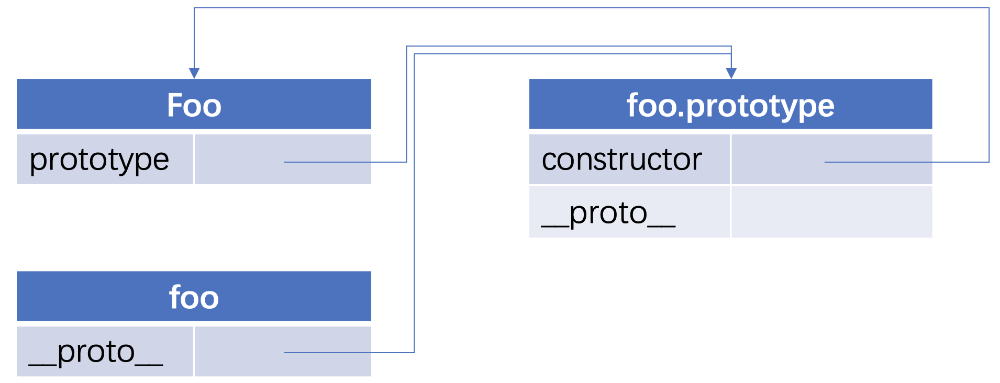
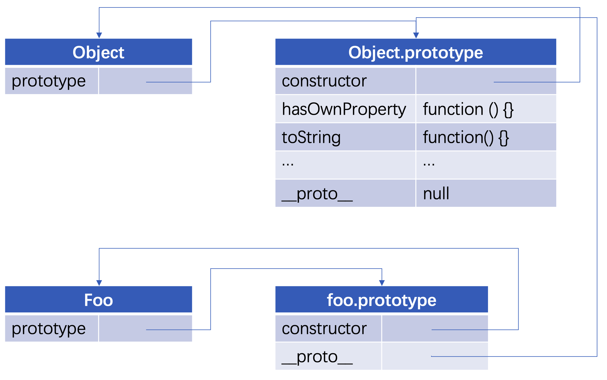
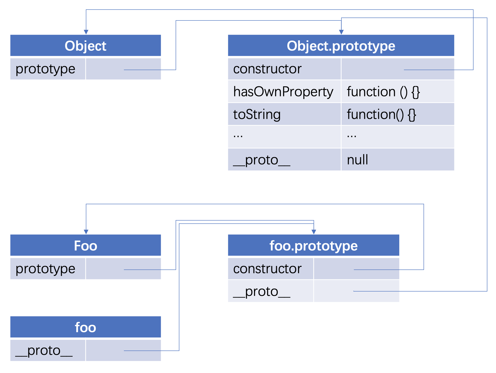

# 原型是什么
先了解下基于原型的编程：

原型程式设计或称为基于原型的编程、原型编程，是面向对象编程的子系统和一种方式。在原型编程中，类不是实时的，而且行为重用（通常认为继承自基于类的语言）是通过复制已经存在的原型对象的过程实现的。这个模型一般被认为是 `classless`、面向原型、或者是基于实例的编程。

原型编程的主张者经常争论说基于类的语言提倡使用一个关注分类和类之间关系开发模型。与此相对，原型编程看起来提倡程序员关注一系列对象实例的行为，而之后才关心如何将这些对象划分到最近的使用方式相似的原型对象，而不是分成类。因为如此，很多基于原型的系统提倡运行时原型的修改，而只有极少数基于类的面向对象系统（比如第一个动态面向对象的系统 `Smalltalk`）允许类在程序运行时被修改。

[sec中的表述](https://www.ecma-international.org/ecma-262/5.1/#sec-4.2.1)

> ECMAScript does not use classes such as those in C++, Smalltalk, or Java. Instead objects may be created in various ways including via a literal notation or via constructors which create objects and then execute code that initialises all or part of them by assigning initial values to their properties. Each constructor is a function that has a property named “prototype” that is used to implement prototype-based inheritance and shared properties. Objects are created by using constructors in new expressions; for example, new Date(2009,11) creates a new Date object. Invoking a constructor without using new has consequences that depend on the constructor. For example, Date() produces a string representation of the current date and time rather than an object.

[sec对prototype的表述](https://www.ecma-international.org/ecma-262/5.1/#sec-4.3.5)：

> object that provides shared properties for other objects

> NOTE: When a constructor creates an object, that object implicitly references the constructor’s “prototype” property for the purpose of resolving property references. The constructor’s “prototype” property can be referenced by the program expression constructor.prototype, and properties added to an object’s prototype are shared, through inheritance, by all objects sharing the prototype. Alternatively, a new object may be created with an explicitly specified prototype by using the Object.create built-in function.

每一个`constructor`函数都有一个`prototype`属性,用于基于原型继承和属性共享，`prototype`为其他对象提供共享属性
根据表述，通过`constructor`创造的对象，原型指向`constructor`，在原型上的属性通过继承会被共享的,可以通过`constructor.prototype`被引用。对应到实现上，就是任意函数上的的`constructor`都有`prototype`属性

## 原型链

在[Objects](https://www.ecma-international.org/ecma-262/5.1/#sec-4.3.26)章节中，sec有对`prototype chain`原型链进行表述:

>Every object created by a constructor has an implicit reference (called the object’s prototype) to the value of its constructor’s “prototype” property. Furthermore, a prototype may have a non-null implicit reference to its prototype, and so on; this is called the prototype chain. 

>译 每一个由构造函数创建的对象都有一个对其构造函数的`prototype`**隐式引用**（称为对象的原型）。此外，一个原型可以对它的原型有一个非空的隐式引用，以此类推，**这就是所谓的原型链**。

对于使用过基于类的语言 (如 `Java` 或 `C++`) 的开发人员来说，`JavaScript` 有点令人困惑，因为它是动态的，并且本身不提供一个 `class` 实现。（在 ES2015/ES6 中引入了 `class` 关键字，但那只是语法糖，`JavaScript` 仍然是基于原型的）。

当谈到继承时，`JavaScript` 只有一种结构：对象。每个实例对象（ `object` ）都有一个私有属性（称之为 __proto__ ）指向它的构造函数的原型对象（`prototype` ）。该原型对象也有一个自己的原型对象( __proto__ ) ，层层向上直到一个对象的原型对象为 `null`。根据定义，`null` 没有原型，并作为这个原型链中的最后一个环节。

几乎所有 `JavaScript` 中的对象都是位于原型链顶端的 `Object` 的实例。

### Object.prototype.constructor

[sec-constructor](https://www.ecma-international.org/ecma-262/6.0/#sec-constructor)

[sec](https://www.ecma-international.org/ecma-262/6.0/#sec-object.prototype.constructor)返回创建实例对象的 `Object` 构造函数的引用。此属性的值是对函数本身的引用，而不是一个包含函数名称的字符串。

  ```js
    function Tree(name) {
    this.name = name;
    }

    var theTree = new Tree("Redwood");
    console.log( "theTree.constructor is " + theTree.constructor );

    //theTree.constructor is function Tree(name) {
    //this.name = name;
    //}
  ```
  ```js
  var a={};//其实是var a=new Object()的语法糖
  var b=[];//其实是var b=new Array()的语法糖
  function Foo() {};//其实是var Foo=new Function(){}的语法糖
  ```

### Object.prototype

几乎所有的 `JavaScript` 对象都是 `Object` 的实例；一个典型的对象继承了`Object.prototype`的属性（包括方法），尽管这些属性可能被遮蔽（亦称为覆盖）。但是有时候可能故意创建不具有典型原型链继承的对象，比如通过`Object.create(null)`创建的对象，或者通过`Object.setPrototypeOf`方法改变原型链。

改变`Object`原型，会通过原型链改变所有对象；除非在原型链中进一步覆盖受这些变化影响的属性和方法。这提供了一个非常强大的、但有潜在危险的机制来覆盖或扩展对象行为。详见[原型链继承](./原型链继承.md)

### `Object.prototype.__proto__`

在Web标准中是不支持的，但是在[ES6](https://www.ecma-international.org/ecma-262/6.0/#sec-additional-properties-of-the-object.prototype-object)中被写入规范

`.__proto__`属性是`Object.prototype` 一个简单的访问器属性，其中包含了`get`（获取）和`set`（设置）的方法，任何一个`__proto__`的存取属性都继承于`Object.prototype`，但一个访问属性如果不是来源于`Object.prototype`就不拥有`.__proto__`属性，譬如一个元素在`Object.prototype`之前设置了其他的`.__proto__`属性，将会覆盖原有的`Object.prototype`。
```js
let Circle = function () {};
let shape = {};
let circle = new Circle();
 
// 设置该对象的原型链引用
shape.__proto__ = circle;
// 判断该对象的原型链引用是否属于circle
console.log(shape.__proto__ === circle); // true
```




[图解](https://www.ecma-international.org/ecma-262/5.1/#sec-4.2.1)：
  `CF`是一个构造函数（也是一个对象）。通过 `new` 创建了五个对象：`cf1、cf2、cf3、cf4和cf5`。 五个对象都包含名为`q1`和`q2`的属性。虚线代表隐式原型关系；所以，例如，`cf3`的原型是`CFp`。构造函数`CF`本身有两个属性，分别命名为`p1`和`p2`，它两对`cfp、cf1、cf2、cf3、cf4和cf5`来说都是不可见的，`CFp`中命名为`CFP1`的属性被`cf1、cf2、cf3、cf4和cf5`共享（但不被`CF`共享），在`CFp`的隐式原型链中发现的任何没有命名为`q1、q2`,`CFP1`的属性也是如此。注意`CF`和`CFp`之间没有隐式原型链。

  不同基于类对象的语言，属性能够通过赋值而被动态的添加上去，因此构造函数不需要给所有被构造出的函数的属性赋值命名。只需要在构造函数就行在`CFp`中添加属性就能够被`cf1, cf2, cf3, cf4, 和 cf5` 共享

下面通过代码分析：

```js
function Foo () {}
console.log(Foo.prototype) // { constructor: f Foo(), __proto__: Object }
```

图标表示：


上图左边代表 `Foo` 函数, 它有一个 `prototype` 属性, 指向右侧这个原型对象, 每声明一个函数, 都会有这样的一个原型对象, 原型对象有一个 `constructor` 属性, 指向 `Foo` 函数本身

将Foo实例化：
```js
const foo = new Foo()
```

`new` 操作符实例化了一个 `foo` 对象, 此时的图解:



`foo` 默认会有个 `__proto__` 属性, 它也指向构造函数 `Foo` 的原型, 这就是 `__proto__` 的作用, 即指向构造函数的原型, 那让我们回到 `Foo.prototype.__proto__`的指向:



上图的 `Foo.prototype.__proto__` 指向 `Object.prototype`, 也就是说, 每个函数的原型, 都是 `Object` 的实例. 

回到
```js
const foo = new Foo()
```


在 `new` 出 `foo` 对象后, 并没有给 `foo` 对象添加任何方法, 但我们依然能从 `foo` 对象中调用 `toString()`, `hasOwnProperty()` 等方法.

从上图的链条来看, 我们在 `foo` 这个对象中, 查找 `toString` 方法, 没找到, 就循着 `foo.__proto__` 查找, `foo.__proto__` 里也没有找到, 就循着 `foo.__proto__.__proto__` 找, 诶这个时候找到了, 则调用, 如果还找不到, 就再往上找, 即 `foo.__proto__._proto__._proto__`, 这个时候值为 `null`, 查找结束.

我们也可以说, `Foo` 继承了 `Object`, 所以 `foo` 中能访问到` Object` 的原型属性.

## 原型规则和示例

  - 所有的引用类型(数组、对象、函数)，都具有对象特性，即可自由扩展属性(除了'null')
  - 所有的引用类型(数组、对象、函数)，都具有proto属性，属性值是一个普通的对象
  - 所有的函数，都有一个prototype属性，属性值也是一个普通对象
  - 所有的引用类型(数组、对象、函数)，proto属性值指向它的构造函数的prototype属性
  - 当试图得到一个对象的某个属性时，如果对象本身没有这个属性，那么会去它的proto（即它的构造函数的prototype）中寻找

  ```js
  var obj={};obj.a=100;
  var arr=[];arr.a=100;
  function fn(){};fn.a=100
  console.log(obj.__proto__);//{constructor: ƒ, __defineGetter__: ƒ, __defineSetter__: ƒ, hasOwnProperty: ƒ, __lookupGetter__: ƒ, …}
  console.log(arr.__proto__);//[constructor: ƒ, concat: ƒ, copyWithin: ƒ, fill: ƒ, find: ƒ, …]
  console.log(fn.__proto__);//ƒ () { [native code] }
  console.log(fn.prototype);//{constructor: ƒ}
  console.log(obj.__proto__===Object.prototype);//true

  function Foo(name,age) {
      this.name=name;
      this.age=age;
  }
  Foo.prototype.alertName=function () {
      alert(this.name)
  }
  var f=new Foo('wbq');
  f.printName=function () {
      console.log(this.name)
  }
  f.printName();
  f.alertName();
  ```

### 循环对象自身的属性方法

1. for...in循环遍历对象自身的和继承的可枚举属性（不含 Symbol 属性）
    ```js
    function Foo(name,age) {
        this.name=name;
        this.age=age;
    }
    Foo.prototype.alertName=function () {
        alert(this.name)
    }
    var f=new Foo('wbq');
    f.printName=function () {
        console.log(this.name)
    }
    f.printName();
    f.alertName();
    for(let i in f){
        console.log(i);//name,age,printName,alertName
    }
    //如何只遍历对象自身的属性，不遍历继承的可枚举属性
    for(let i in f){
        if(f.hasOwnProperty(i)){
            console.log(i,f[i])
        }
    }
    ```

2. Object.keys(obj)

- Object.keys返回一个数组，包括对象自身的（不含继承的）所有可枚举属性（不含 Symbol 属性）的键名。
- 大多数时候，我们只关心对象自身的属性。所以，尽量不要用for...in循环，而用Object.keys()代替。
- Object.values(obj)：方法返回一个数组，成员是参数对象自身的（不含继承的）所有可遍历（enumerable）属性的键值。
- Object.entries()：方法返回一个数组，成员是参数对象自身的（不含继承的）所有可遍历（enumerable）属性的键值对数组。
  ```js
  console.log(Object.keys(f));// ["name", "age", "printName"]

  let obj={
      'name':'wbq',
      'age':20,
      sayName(){
          console.log(this.name)
      }
  }
  console.log(Object.keys(obj));//[ 'name', 'age', 'sayName' ]
  console.log(Object.values(obj));//[ 'wbq', 20, [Function: sayName] ]


  console.log(Object.entries(obj));
  // [ [ 'name', 'wbq' ],
  //     [ 'age', 20 ],
  //     [ 'sayName', [Function: sayName] ] ]
  ```

3. Object.getOwnPropertyNames(obj)

    Object.getOwnPropertyNames返回一个数组，包含对象自身的所有属性（不含 Symbol 属性，但是包括不可枚举属性）的键名。

4. Object.getOwnPropertySymbols(obj)

    Object.getOwnPropertySymbols返回一个数组，包含对象自身的所有 Symbol 属性的键名。

5. Reflect.ownKeys(obj)

    Reflect.ownKeys返回一个数组，包含对象自身的所有键名，不管键名是 Symbol 或字符串，也不管是否可枚举。

### quote

> [继承与原型链](https://developer.mozilla.org/zh-CN/docs/Web/JavaScript/Inheritance_and_the_prototype_chain)

> [proto](https://developer.mozilla.org/en-US/docs/Web/JavaScript/Reference/Global_Objects/Object/proto)

> [constructor](https://developer.mozilla.org/zh-CN/docs/Web/JavaScript/Reference/Global_Objects/Object/constructor)
> [原型程式设计【原型语言】](https://blog.csdn.net/xqj198404/article/details/17963129)


> [原型模式,不只是clone那么简单](https://www.cnblogs.com/winter-cn/archive/2009/12/02/1614987.html)
