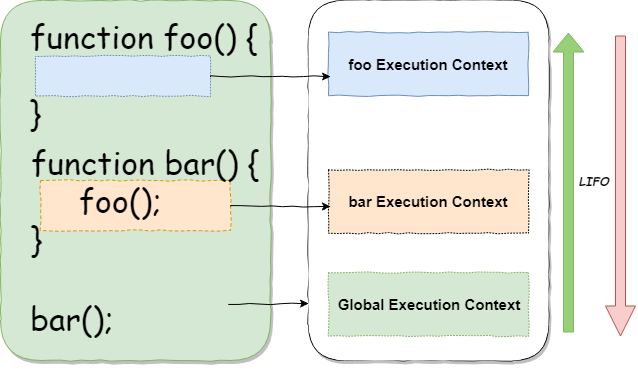
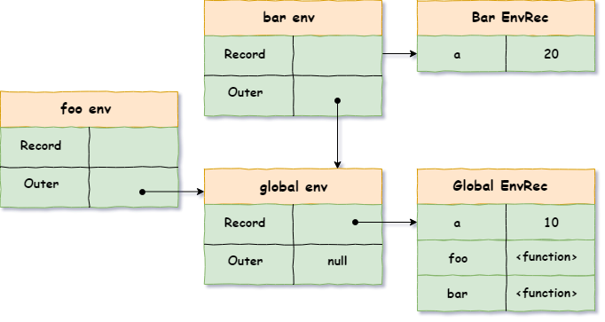

# 大纲


##

本次书写规范依据最新的ECMA262-11th edition (June 2020),在ES5中，创建分为了三大部分，而今创建分为了两大部分，而且componet的数量也发生了变化，主要从sec中理解到“执行上下文”是什么便可，具体实现不追究，词法环境是一个逻辑化的概念，并不指意在代码实现上直接展示出来。

A Lexical Environment is created behind the scenes. It’s just a logistical concept. There is no way to actually access it from your JavaScript code.

## 作用域

作用域是当前上下文中，按照具体规则能够访问到的标识符（变量）的范围,作用域共有两种主要的工作模型。第一种是最为普遍的，被大多数编程语言所采用的词法作用域，另外一种叫作动态作用域，仍有一些编程语言在使用（比如Bash脚本、Perl中的一些模式等）。

词法作用域：在词法阶段的作用域。换句话说，词法作用域是由你在写代码时将变量和块作用域写在哪里来决定的，因此当词法分析器处理代码时会保持作用域不变（大部分情况下是这样的）

例子：
```js
function foo() {
  console.log(a);
}

function bar() {
  let a = 3;
  foo();
}

let a = 2;

bar(); // 2
```
能看出，这段程序会输出 2，但如果在动态作用域的规则下，应该输出 3，即 a 的引用不再是编译时确定，而是调用时确定的。这有点像 JavaScript 中的 this，所以 MDN 中，[function.bind](https://developer.mozilla.org/en-US/docs/Web/JavaScript/Reference/Global_Objects/Function/bind) 的方法签名中第一个形参名称用的是 thisArg 这一更科学的名字：

>fun.bind(thisArg[, arg1[, arg2[, ...]]])

同样情况的还可见于 [Lodash](https://lodash.com/docs/4.17.15#bind) 的文档：
>_.bind(func, thisArg, [partials])

**作用域链**：
- 由当前执行环境的变量对象（未进入执行阶段前）与上层环境的一系列活动对象组成，它保证了当前执行环境对符合访问权限的变量和函数的有序访问。
- 当查找变量的时候，会先从当前上下文的变量对象中查找，如果没有找到，就会从父级执行上下文的变量对象中查找，一直找到全局上下文的变量对象。这样由多个执行上下文的变量对象构成的链表就叫做作用域链。

### 变量提升
 - 很据JavaScriptf作者Brendan的回复，理解为当时设计语言时太匆忙了，便丁实现就搞了个变量提升
 - 《浏览器中的JavaScript执行机制》：JavaScript代码执行过程中，需要先做变量提升。而之所以需要实现变量提升，是因为JavaScript代码在执行之前需要先编译。在编译阶段，变量和函数会被存放到变量环境中，交量的默认值会被设为undefined;在代码执行阶段，JavaScript引学会从变量环境中去查找自定义的变量和函数。

### Lexical Environments

  用于根据ECMAScript代码的词法嵌套结构来定义标识符与特定变量和函数的关联。每次代码运行都会产生词法环境，词法环境就是一种标识符—变量映射的结构(这里的标识符指的是变量/函数的名字，变量是对实际对象[包含函数和数组类型的对象]或基础数据类型的引用)

  - 函数声明
  - 块语句
  - try catch

  - 词法环境会层层嵌套
  - global environment 是顶层，它的上层引用是`null`
  - module environment 是Module模块的顶层，它的上层是global enviorment
  - function environment 与函数运行的环境对应


### Environment Records

 环境记录主要有两种Records：
 - Declarative Environment Records 声明性环境记录

   主要于语法元素上：如函数声明 变量声明 Catch等
 - Object Environment Records 对象环境记录

   主要于一些对象的属性上

- Global Environment Records
  顶层脚本声明
- Function Environment Records 
  函数内的顶层声明

  字段声明值：
    - `[[ThisBindingStatus]]`  lexical |initialized |uninitialized
  如果是`lexical`说明是箭头函数，没有`this`值

## Execution Contexts

### Execution context

执行上下文：提供追踪代码运行的一个实现

 - execution context stack 执行上下文调用栈 用于跟踪执行上下文
  
 - 执行上下文一般都是通过调用栈来实现，但有些ECMAScript功能的执行上下文不是通过LIFO的栈来调用的
 - running execution context 在栈顶层的元素，每一个当前新建的都会取代之前的，把之前的压下去

 每一个执行上下文都至少包含以下状态部分：

 - code evaluation state : 执行、暂停、恢复当前执行上下文
 - Function : 如果当前执行上下文为函数对象，则值为函数对象，如果是Script 或者Module 则值为null
 - Realm: 代码上的范围
 - ScriptOrModule: 为Modlue 或 Script  或者null
 - running execution context 正在执行上下文也叫做当前范围记录，当前的函数部分也被成为active function object （中文有叫活动对象AO）

 附加部分：

（ Lexical
Environments）

 - LexicalEnvironment
 - VariableEnvironment

（GeneratorObject）
- Generator
### 创建

执行上下文是在创建阶段被创建的，创建阶段包括以下几个方面：

- 创建词法环境；
- 创建变量环境；
因此执行上下文可以抽象为下面的形式：
```js
ExecutionContext = {
  LexicalEnvironment = <ref. to LexicalEnvironment in memory>,
  VariableEnvironment = <ref. to VariableEnvironment in  memory>,
}
```
环境记录对象在创建阶段也被称为变量对象(VO)，在执行阶段被称为活动对象(AO)。之所以被称为变量对象是因为此时该对象只是存储执行上下文中变量和函数声明，之后代码开始执行，变量会逐渐被初始化或是修改，然后这个对象就被称为**活动对象**

### 上下文大致结构
  ```js
  // Execution context in ES5
  ExecutionContext = {
    ThisBinding: <this value>,
    VariableEnvironment: { ... },
    LexicalEnvironment: { ... }
  }
  // ES2020
  ExecutionContext = {
    VariableEnvironment: { 
      ThisBinding: <this value>,
      ... 
    },
    LexicalEnvironment: { 
      ThisBinding: <this value>,
      ... 
    }
  }
  ```
## 例子

- 1.写出执行上下文
  ```js
  let a = 20;  
  const b = 30;  
  var c;

  function multiply(e, f) {  
  var g = 20;  
  return e * f * g;  
  }

  c = multiply(20, 30);
  ```

  
  ```
  ///----------1创建
  GlobalExectionContext = {
    LexicalEnvironment: {
      EnvironmentRecord: {
        Type: "Object",
        // Identifier bindings go here
        a: < uninitialized >,
        b: < uninitialized >,
        multiply: < func >
      }
      outer: <null>,
      ThisBinding: <Global Object>
    },
    VariableEnvironment: {
      EnvironmentRecord: {
        Type: "Object",
        // Identifier bindings go here
        c: undefined,
      }
      outer: <null>,
      ThisBinding: <Global Object>
    }
  }

  ///------------2执行赋值
  GlobalExectionContext = {
  LexicalEnvironment: {
      EnvironmentRecord: {
        Type: "Object",
        // Identifier bindings go here
        a: 20,
        b: 30,
        multiply: < func >
      }
      outer: <null>,
      ThisBinding: <Global Object>
    },
  VariableEnvironment: {
      EnvironmentRecord: {
        Type: "Object",
        // Identifier bindings go here
        c: undefined,
      }
      outer: <null>,
      ThisBinding: <Global Object>
    }
  }

  ----------3运行multiply(20, 30)
  FunctionExectionContext = {
  LexicalEnvironment: {
      EnvironmentRecord: {
        Type: "Declarative",
        // Identifier bindings go here
        Arguments: {0: 20, 1: 30, length: 2},
      },
      outer: <GlobalLexicalEnvironment>,
      ThisBinding: <Global Object or undefined>,
    },
  VariableEnvironment: {
      EnvironmentRecord: {
        Type: "Declarative",
        // Identifier bindings go here
        g: undefined
      },
      outer: <GlobalLexicalEnvironment>,
      ThisBinding: <Global Object or undefined>
    }
  }
  -----------4完成
  FunctionExectionContext = {
  LexicalEnvironment: {
      EnvironmentRecord: {
        Type: "Declarative",
        // Identifier bindings go here
        Arguments: {0: 20, 1: 30, length: 2},
      },
      outer: <GlobalLexicalEnvironment>,
      ThisBinding: <Global Object or undefined>,
    },
  VariableEnvironment: {
      EnvironmentRecord: {
        Type: "Declarative",
        // Identifier bindings go here
        g: 20
      },
      outer: <GlobalLexicalEnvironment>,
      ThisBinding: <Global Object or undefined>
    }
  }
    ```

- 2.写出上下文调用栈

  ```js
  let a = 'Hello World!';
  function first() {
    console.log('Inside first function');
    second();
    console.log('Again inside first function');
  }
  function second() {
    console.log('Inside second function');
  }
  first();
  console.log('Inside Global Execution Context');
  ```

  ```
  //EC == Execution Context
                                  |Second() EC|
                 | First() EC|    | First() EC|    | First() EC|
  |Global EC| -> | Global EC | -> | Global EC |  ->| Global EC | -> | Global EC |
  ```

- 3.

  ```js
    function foo(a) {
    var b = 20;
  }
  foo(10);
  // the VariableEnvironment component of the foo function context at creation stage
  fooContext.VariableEnvironment = {
    environmentRecord: {
      arguments: { 0: 10, length: 1, callee: foo },
      a: 10,
      b: undefined
    },
    outer: globalEnvironment
  };
  // After the execution stage, the VE envRec table is filled in with the value
  fooContext.VariableEnvironment = {
    environmentRecord: {
      arguments: { 0: 10, length: 1, callee: foo },
      a: 10,
      b: 20
    },
    outer: globalEnvironment
  };
  ```
- 4.
  ```js
  var a = 10; 
  function foo(){
    console.log(a);
  };
  function bar(){
    var a = 20; 
    foo();
  };
  bar(); // will print "10"
  ```
  ```js
  // check for binding "a" in the env record of "foo"
  -- foo.[[LexicalEnvironment]].[[Record]] --> not found
  // if not found, check for its outer environment
  --- global[[LexicalEnvironment]][[Record]] --> found 10
  // resolve the identifier with a value of 10
  ```
  

### Quote

> [sec-executable-code-and-execution-contexts](https://tc39.es/ecma262/#sec-executable-code-and-execution-contexts)

> [ES5-execution-contexts](https://ecma-international.org/ecma-262/6.0/#sec-execution-contexts)

> [Scope (computer science)](https://en.wikipedia.org/wiki/Scope_%28computer_science%29)

> [Understanding Execution Context and Execution Stack in Javascript](https://blog.bitsrc.io/understanding-execution-context-and-execution-stack-in-javascript-1c9ea8642dd0)

> [Lexical Environment — The hidden part to understand Closures](https://medium.com/@5066aman/lexical-environment-the-hidden-part-to-understand-closures-71d60efac0e0)

> [JavaScript Tutorial — Lexical Environment](https://medium.com/@js_tut/javascript-tutorial-lexical-environment-3ee161bb2295)