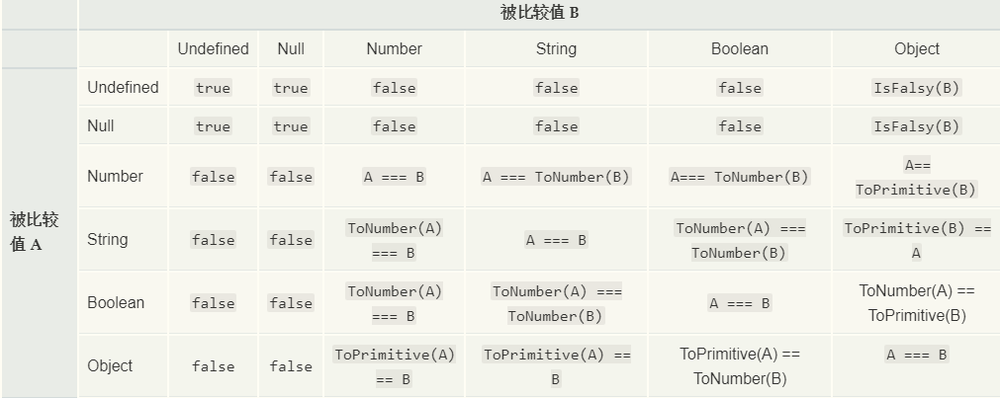

# -
[相等性判断](https://developer.mozilla.org/zh-CN/docs/Web/JavaScript/Equality_comparisons_and_sameness)

[Object.js()](https://developer.mozilla.org/zh-CN/docs/Web/JavaScript/Reference/Global_Objects/Object/is)

[宽松相等](https://developer.mozilla.org/zh-CN/docs/Web/JavaScript/Reference/Operators/%E7%9B%B8%E7%AD%89)

[严格相等](https://developer.mozilla.org/en-US/docs/Web/JavaScript/Reference/Operators/Strict_equality)

JavaScript提供三种不同的值比较操作：

- 严格相等比较 (也被称作"strict equality", "identity", "triple equals")，使用 === ,
- 抽象相等比较 ("loose equality"，"double equals") ，使用 ==
- 以及 Object.is （ECMAScript 2015/ ES6 新特性）

## ===

&emsp;全等操作符比较两个值是否相等，两个被比较的值在比较前都不进行隐式转换。如果两个被比较的值具有不同的类型，这两个值是不全等的。否则，如果两个被比较的值类型相同，值也相同，并且都不是 number 类型时，两个值全等。最后，如果两个值都是 number 类型，当两个都不是 NaN，并且数值相同，或是两个值分别为 +0 和 -0 时，两个值被认为是全等的。

&emsp;在日常中使用全等操作符几乎总是正确的选择。对于除了数值之外的值，全等操作符使用明确的语义进行比较：一个值只与自身全等。对于数值，全等操作符使用略加修改的语义来处理两个特殊情况：第一个情况是，浮点数 0 是不分正负的。区分 +0 和 -0 在解决一些特定的数学问题时是必要的，但是大部分情况下我们并不用关心。全等操作符认为这两个值是全等的。第二个情况是，浮点数包含了 NaN 值，用来表示某些定义不明确的数学问题的解，例如：正无穷加负无穷。全等操作符认为 NaN 与其他任何值都不全等，包括它自己。（等式 (x !== x) 成立的唯一情况是 x 的值为 NaN）

 === 运算符 (也包括 == 运算符) 将数字 -0 和 +0 视为相等 ，而将Number.NaN 与NaN视为不相等.

 算法： 

 - 如果两个操作数类型不同，则返回false
 - 如果两个操作数都是object,且引用为同一个object，返回true
 - 如果两个操作数都为null,或都为undefined，则返回true
 - 如果两个操作数都是NaN,则返回false
 - 上述外的情况：
  - Number类型必须有相同语义的数值表示时返回true，反之为false,如1 和 1比较返回true, 1 和 -1 返回false。+0 和-0在数值语义上认为是相等，返回true.
  - String类型必须有相同的字符且同序
  - Boolean类型必须同时为true 或同时为false

## == 

相等操作符比较两个值是否相等，在比较前将两个被比较的值转换为相同类型。在转换后（等式的一边或两边都可能被转换），最终的比较方式等同于全等操作符 === 的比较方式。 相等操作符满足交换律。

相等运算符（==和!=）使用抽象相等比较算法比较两个操作数。可以大致概括如下：

- 如果两个操作数都是对象，则仅当两个操作数都引用同一个对象时才返回true。
- 如果一个操作数是null，另一个操作数是undefined，则返回true。
- 如果两个操作数是不同类型的，就会尝试在比较之前将它们转换为相同类型：
  - 当数字与字符串进行比较时，会尝试将字符串转换为数字值。
  - 如果操作数之一是Boolean，则将布尔操作数转换为1或0。
    - 如果是true，则转换为1。
    - 如果是 false，则转换为0。
  - 如果操作数之一是对象，另一个是数字或字符串，会尝试使用对象的valueOf()和toString()方法将对象转换为数字。
- 如果操作数具有相同的类型，则将它们进行如下比较：
  - String：true仅当两个操作数具有相同顺序的相同字符时才返回。
  - Number：true仅当两个操作数具有相同的值时才返回。+0并被-0视为相同的值。如果任一操作数为NaN，则返回false。
  - Boolean：true仅当操作数为两个true或两个时才返回false。

速查图

## 同值相等

同值相等,确定两个值是否在任何情况下功能上是相同的,例如-0 和 +0 则视为不相等

Object.is() 方法判断两个值是否为同一个值。如果满足以下条件则两个值相等:

- 都是 undefined
- 都是 null
- 都是 true 或 false
- 都是相同长度的字符串且相同字符按相同顺序排列
- 都是相同对象（意味着每个对象有同一个引用）
- 都是数字且
  - 都是 +0
  - 都是 -0
  - 都是 NaN
  - 或都是非零而且非 NaN 且为同一个值

## 零值相等(同值零)

认为 +0 与 -0 相等,用于` %TypedArray%` 和 `ArrayBuffer` 构造函数、以及Map和Set操作, 并将用于 ES2016/ES7 中的`String.prototype.includes`